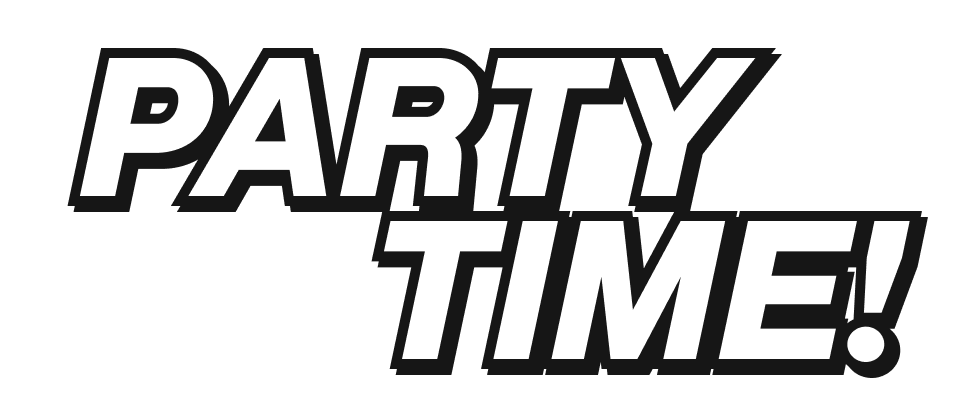
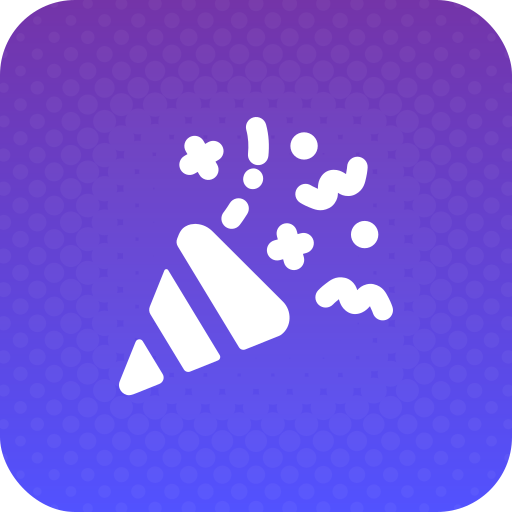

    

#  Party Time!
An augmented reality party game written in C# using the Godot Engine.

## Requirements
- Godot Engine 4.3
- .NET SDK 8.0

## Running
### From Source
Clone this repository locally and open the game project in the Godot Editor.

### Prebuilt Binaries
Get a prebuilt binary from the releases.

## Building
### Desktop
To build the game, you must meet the [requirements](#requirements).

### Android
To build the game, aside from the [requirements](#requirements), you also are required to install these prerequisites:
- Android Platform Build Tools
- JDK 17

## License
This repository is licensed under MIT. You can read more about it [here](./LICENSE).

### Thirdparty
Some of the source code in this repository is licensed under different schemes. Read more about it [here](./source/THIRDPARTY-LICENSE.txt)